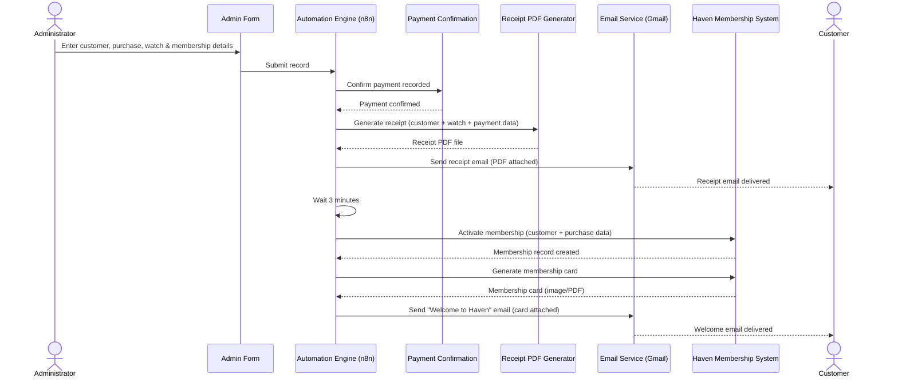
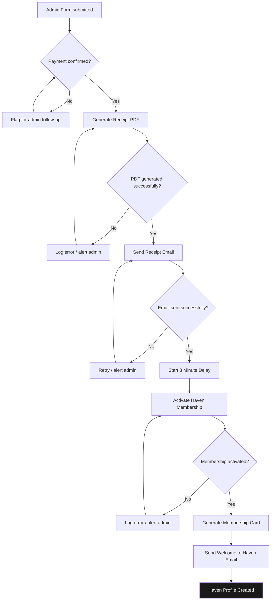
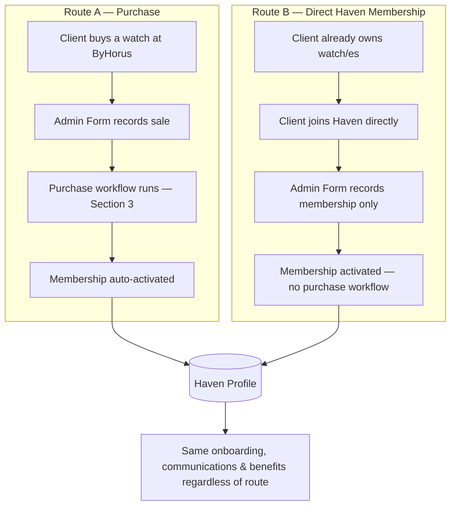
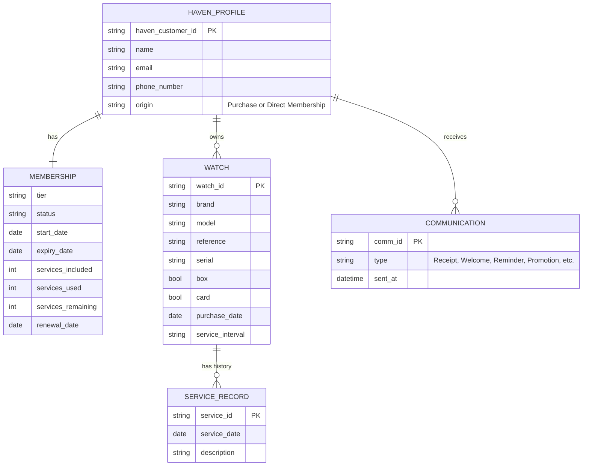
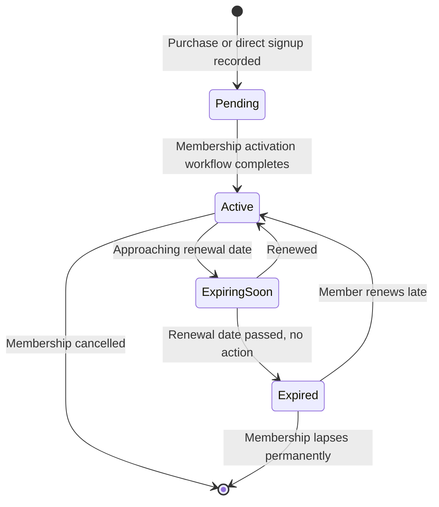
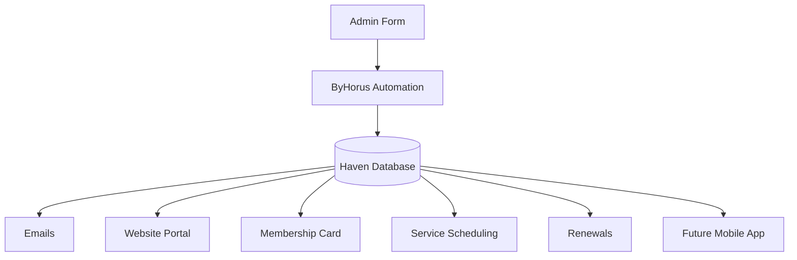
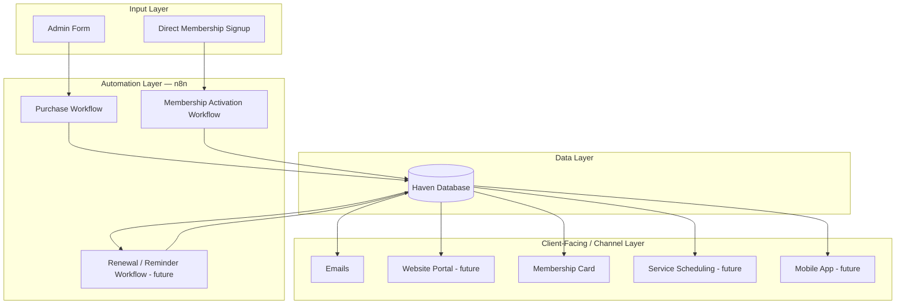
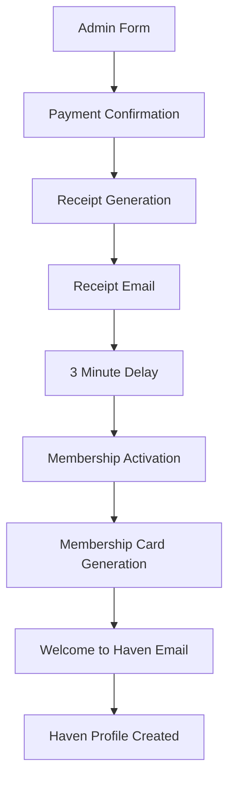
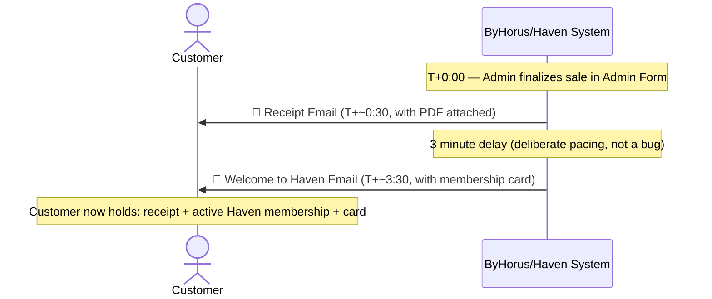

# ByHorus × Haven Ecosystem

### Vision & System Blueprint

**Version:** 1.0 (current planning document)
**Status:** Version 1 in active development
**Audience:** Any developer, contributor, or AI agent picking up this project

---

## Purpose of This Document

This document is the single source of truth for the ByHorus × Haven ecosystem's
goals, architecture, and current build status. If you are a developer or an AI
agent encountering this project for the first time, reading this file top to
bottom should be enough to understand:

- what has already been built,
- what is currently in progress,
- what is planned for later,
- and the underlying philosophy that should guide every future decision.

When in doubt about "why does this work this way," the answer should be in
here. If you make an architectural decision that changes the plan described
below, **update this document in the same change** so it stays authoritative.

---

## Table of Contents

1. [Executive Summary](#1-executive-summary)
2. [Current Mission (V1 Scope)](#2-current-mission-v1-scope)
3. [System Flow — Version 1](#3-system-flow--version-1)
4. [Entry Points](#4-entry-points)
5. [Operational Decisions for V1](#5-operational-decisions-for-v1)
6. [Project Status](#6-project-status)
7. [Data Model — The Haven Profile](#7-data-model--the-haven-profile)
8. [Long-Term Vision](#8-long-term-vision)
9. [Website Vision](#9-website-vision)
10. [Guiding Philosophy — Single Source of Truth](#10-guiding-philosophy--single-source-of-truth)
11. [Recommended Architecture Evolution](#11-recommended-architecture-evolution)
12. [Version 1 — Definition of Done](#12-version-1--definition-of-done)
13. [Roadmap Beyond V1](#13-roadmap-beyond-v1)
14. [Glossary](#14-glossary)
15. [Notes for Future Contributors & AI Agents](#15-notes-for-future-contributors--ai-agents)

---

## 1. Executive Summary

The objective is to build an integrated ecosystem connecting the purchase of
luxury watches at **Jewelry & Watches ByHorus** with **Haven**, the company's
long-term watch care platform.

The ecosystem provides a seamless experience that begins with either a watch
purchase or a direct Haven membership, and continues throughout the
customer's entire ownership journey.

Haven is not just a membership program bolted onto a storefront. It is meant
to become **the central platform for luxury watch ownership** — covering
maintenance, servicing, communication, and the long-term customer
relationship.

The current implementation focuses on getting the foundational workflows
right, while deliberately designing them so the system can grow into a much
larger platform later **without a full redesign**.

---

## 2. Current Mission (V1 Scope)

The immediate objective is **not** to build the entire Haven platform.

The current mission is to successfully connect the **ByHorus purchase
workflow** with the **Haven onboarding workflow**, creating one continuous
customer journey — from payment through membership activation.

---

## 3. System Flow — Version 1

### 3.1 High-level sequence

This sequence diagram shows *who/what* is responsible for each step and what
data moves between them — not just the order of events.

### 3.2 Detailed workflow with decision points

The sequence above assumes the happy path. In practice, each stage is a node
(or group of nodes) in the automation tool and can fail or branch. The
diagram below makes those branches explicit so error handling isn't an
afterthought.

Once this sequence completes, the purchase process naturally transitions the
client into Haven — no manual handoff required, **and every failure path has
somewhere defined to go** rather than failing silently.

---

## 4. Entry Points

There are two ways a customer enters the ecosystem. Both eventually create
the **same Haven profile** — this is deliberate; see
[Section 10](#10-guiding-philosophy--single-source-of-truth).

### Route A — Purchase

A client purchases a watch from ByHorus. The purchase workflow automatically
transitions the client into Haven (the flow in [Section 3](#3-system-flow--version-1)).

### Route B — Direct Haven Membership

A client already owns one or more watches and joins Haven independently, with
no purchase involved. After joining, the client enters the same Haven
ecosystem as every purchaser.

---

## 5. Operational Decisions for V1

To reduce complexity during Version 1 development:

- **Only the Admin Form is used.** The client does not complete any forms
  themselves.
- **The administrator records everything**, including:
  - Customer information
  - Purchase details
  - Membership details
  - Watch information
- This gives the automation a **single source of input** to build from.

Client self-service (the client filling out their own forms, registering
their own watches, etc.) may be introduced in a future version — it is
explicitly out of scope for V1.

---

## 6. Project Status

> Keep this section current. When something moves from one list to another,
> edit this file as part of that change.

### ✅ Completed

- [x] Admin Form
- [x] Payment recording
- [x] Receipt data preparation
- [x] Receipt PDF generation
- [x] Receipt email
- [x] Premium receipt redesign
- [x] Haven membership concept
- [x] Haven onboarding email concept
- [x] Membership card concept
- [x] Automation architecture

### 🔧 Currently Being Built

- [ ] Transition from receipt email to Haven onboarding
- [ ] Membership activation workflow
- [ ] Membership card generation
- [ ] Haven welcome email
- [ ] Haven profile creation

### 🔭 Future Development

- [ ] Haven database
- [ ] Website / client portal
- [ ] Watch registration
- [ ] Service scheduling
- [ ] Renewal engine
- [ ] Promotion engine
- [ ] Payment automation
- [ ] Client dashboard
- [ ] Analytics

---

## 7. Data Model — The Haven Profile

Each Haven member will eventually have a single, permanent profile. This is
the target schema — not all fields are populated by V1 automation yet, but
everything should be designed to converge on this shape.

### 7.1 Entity relationships

### Personal Information

| Field | Description |
|---|---|
| Haven Customer ID | Unique, permanent identifier for the member |
| Name | Full name |
| Email | Primary contact email |
| Phone Number | Primary contact number |
| Origin | `Purchase` or `Direct Membership` — see [Entry Points](#4-entry-points) |

### Membership

| Field | Description |
|---|---|
| Tier | Membership tier/level |
| Status | Active, expired, etc. |
| Start Date | Membership start date |
| Expiry Date | Membership expiry date |
| Services Included | Services granted by the membership tier |
| Services Used | Services the member has consumed |
| Services Remaining | Services left on the current cycle |
| Renewal Date | Next renewal date |

### Watch Portfolio

One customer may register **multiple watches**. Each watch stores:

| Field | Description |
|---|---|
| Brand | Watch brand |
| Model | Watch model |
| Reference | Reference number |
| Serial | Serial number |
| Box | Whether the original box is included |
| Card | Whether the original warranty card is included |
| Purchase Date | Date of purchase |
| Service Interval | How often the watch should be serviced |
| Service History | Record of past servicing |

### Communication History

Every automated communication should eventually be recorded against the
member's profile, including:

- Receipt Email
- Welcome Email
- Membership Card
- Booking Confirmation
- Reminder Emails
- Promotions
- Newsletters
- Renewal Notices

### 7.2 Membership lifecycle

The `Membership.Status` field (see [above](#membership)) moves through a
defined set of states. This isn't built yet in V1, but any future renewal or
reminder engine should be designed against this state machine rather than
inventing ad hoc status strings.

---

## 8. Long-Term Vision

Haven is not simply a membership. It is intended to become **the digital
ownership platform** for every watch entrusted to ByHorus.

The platform should eventually support:

- Membership management
- Watch registration
- Service scheduling
- Service history
- Maintenance reminders
- Membership renewals
- Promotional campaigns
- Client communication
- Watch portfolio management
- Long-term ownership records

---

## 9. Website Vision

A Haven website is planned as the long-term client interface — the primary
destination for members. Rather than replacing email, **the website
complements it**: emails become notifications that direct clients back to the
portal.

Potential website capabilities include:

- Secure login
- Membership details
- Membership card
- Watch portfolio
- Service history
- Booking services
- Membership renewal
- Adding additional watches
- Viewing benefits
- Communication archive

---

## 10. Guiding Philosophy — Single Source of Truth

The ecosystem should maintain **one** source of truth.

Rather than creating separate systems for purchasers and direct members, both
entry points ultimately create the same Haven profile. Every future feature
should read from this unified profile.

This minimizes duplication and simplifies long-term maintenance. **Any new
feature that would require its own separate data store instead of reading
from the Haven profile should be treated as a design smell** — reconsider the
approach before building it.

---

## 11. Recommended Architecture Evolution

Earlier planning discussed the website primarily as a place for clients to
*view* information, with the automation layer generating each channel's
content independently. The recommended refinement is to make the **Haven
Database** the true center of the system, with every channel — including
email — reading from it rather than generating content in isolation.

### 11.1 Simple view

### 11.2 Layered view

This is the same idea broken into architectural layers, which is more useful
once the system has more than a handful of nodes. Each layer only talks to
the layer directly next to it — a channel in the "Client-Facing Layer" should
never reach into the "Input Layer" directly.

This keeps the Haven Database as the single source of truth. Every future
channel — email, website, mobile app, analytics, and automation — reads from
that same data, allowing the ecosystem to grow **without redesigning its
foundation**.

> **Implication for builders:** when implementing V1 automations now, prefer
> writing data into a shape that could plausibly live in the future Haven
> Database, rather than hard-coding values directly into individual emails or
> documents. This makes the eventual migration to this architecture far less
> disruptive.

---

## 12. Version 1 — Definition of Done

Version 1 is considered complete when the following workflow operates
reliably, end to end, for every purchasing client:

### 12.1 What the customer actually experiences

The diagram above is the *system's* view. From the **customer's** side, it
plays out as a timeline of two emails a few minutes apart — worth diagramming
separately since it's what actually gets tested/QA'd against expectations.

At this point, every client who purchases a watch is successfully onboarded
into Haven with no manual intervention.

---

## 13. Roadmap Beyond V1

Once Version 1 is stable, the ecosystem expands without changing its
foundation. Planned growth includes:

- Haven database
- Website portal
- Watch registration
- Multi-watch ownership
- Service scheduling
- Renewal management
- Client dashboard
- Online payments
- QR membership cards
- Mobile application
- Reporting and analytics

See [Section 11](#11-recommended-architecture-evolution) for how these should
plug into the architecture: everything reads from and writes to the Haven
Database, not to each other directly.

---

## 14. Glossary

| Term | Meaning |
|---|---|
| **ByHorus** | Jewelry & Watches ByHorus — the luxury watch retailer |
| **Haven** | The long-term watch care and ownership platform tied to ByHorus |
| **Haven Profile** | The single permanent record for a Haven member — see [Section 7](#7-data-model--the-haven-profile) |
| **Admin Form** | The internal form used by ByHorus staff to record a purchase; the only client-data entry point in V1 |
| **Route A / Route B** | The two ways a client can enter the ecosystem — via purchase or via direct Haven membership; see [Section 4](#4-entry-points) |
| **V1** | Version 1 — the current, minimal build described in this document |

---

## 15. Notes for Future Contributors & AI Agents

If you are picking this project up — whether you're a human developer or an
AI agent working on it — here's how to use this document:

1. **Treat this file as canonical.** If code, workflows, or other docs
   disagree with what's written here, that's a bug in one of the two — flag
   it, don't silently pick a side.
2. **Check [Section 6](#6-project-status) first.** It tells you what's
   already built, what's mid-flight, and what hasn't been started. Don't
   re-build something already marked complete without checking why it might
   need revisiting.
3. **Respect the V1 scope boundary** ([Section 2](#2-current-mission-v1-scope),
   [Section 5](#5-operational-decisions-for-v1)). It's tempting to jump ahead
   to website portals or client self-service — those are intentionally
   deferred. Don't add scope to V1 without updating this document to reflect
   that decision.
4. **Design new data toward the Haven Profile shape** ([Section 7](#7-data-model--the-haven-profile))
   even before the Haven Database exists, and toward the centralized
   architecture in [Section 11](#11-recommended-architecture-evolution) —
   channels should read from shared data, not generate it independently.
5. **When you finish something, move it in [Section 6](#6-project-status)**
   and update any diagrams this document contains if the flow changed.
6. **When you're unsure why a decision was made**, check
   [Section 10](#10-guiding-philosophy--single-source-of-truth) and
   [Section 11](#11-recommended-architecture-evolution) — most "why not just
   do X instead" questions trace back to the single-source-of-truth
   philosophy.

The goal is that anyone — or anything — reading this file can pick up exactly
where the last contributor left off, with full context and no guesswork.
